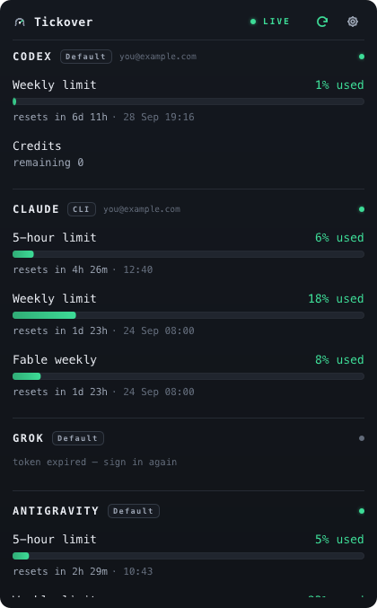

# Tickover

Your AI coding-assistant quota windows, kept running back to back. When a
provider's 5-hour window has reset and is sitting empty, Tickover — once you
switch it on for that provider; Codex and Claude today — sends one tiny
prompt so the new window starts counting now, not at your first real
request hours later. It also meters what is left: the 5-hour and weekly
windows of Codex, Claude and Antigravity, Grok's weekly credit usage, the
balances of Grok, GitHub Copilot and Codex credits, in the macOS menu bar or
the Windows system tray, with a countdown that ticks every second.

Rust + [Slint](https://slint.dev). One small native binary (about 8 MB per
architecture), no runtime, no account to create, no telemetry. **Every
provider is a TOML file**, not a module: when an endpoint changes shape, the
fix is an edit, not a release.

**macOS · Windows** &nbsp;|&nbsp; **MIT or Apache-2.0**

<p align="center">
  
</p>

<p align="center">
  
  &nbsp;&nbsp;
  
</p>

## Download

[**Latest release**](https://github.com/ksavkin/tickover/releases/latest):

- `Tickover-vX.Y.Z-macos-universal.zip` — `Tickover.app`, one universal
  binary built for Apple silicon and Intel; the bundle declares macOS 11 or
  later. Only Apple silicon has been tested.
- `tickover-vX.Y.Z-windows-x86_64.zip` — a bare `tickover.exe`, no
  installer needed.
- `SHA256SUMS.txt` — checksums of both.

Builds are not yet signed with a developer identity (the macOS app carries
only an ad-hoc signature). macOS says "Apple could not verify…": right-click
→ *Open*, or System Settings → Privacy & Security → *Open Anyway*, or
`xattr -d com.apple.quarantine /Applications/Tickover.app`. Windows shows
SmartScreen: *More info* → *Run anyway*. What changes once signing exists is
in [`docs/RELEASING.md`](docs/RELEASING.md). Then: be signed into the CLI you
want watched, launch, and left-click the tray glyph. There is nothing else
to set up.

## How the ping works

A 5-hour window starts at your first request, not at the reset. Reset at
03:00, first prompt at 09:00: six hours of quota went nowhere. Tickover
watches each provider's primary window and, when it sees it sitting
**empty** — reset, nothing used — runs one small command: `codex exec …
hello`, `claude -p hello --model haiku`. That window starts counting now —
and because a window starts at the first request, a weekly window that had
reset starts with it.

The test is "empty", not "the reset just happened", so a machine asleep at
the boundary pings when it wakes instead of losing the window for good — but
never before the window has actually started, and never more than once every
ten minutes, whatever a manifest's own numbers say. One ping per window,
remembered across restarts; a ping that failed is owed again one window
later, never more often. The command runs in a directory created fresh for
that one run — normally under the OS temp directory, removed once the
command exits — so there is nothing there for a prompt to pick up, with the
Codex sandbox read-only and the usual CLI directories *appended* to `PATH`.
Off by default, a switch per provider; costs a few tokens per window. The
Codex and Claude manifests declare one today.

A manifest can also set `[ping] renews_token = true` — Claude's does — which
arms a second trigger for that same command: a surface whose auth chain
declares a token expiry finding its token lapsed, or the provider flatly
refusing it. That runs under the same ten-minute floor, at most once per
distinct token per surface, and a renewal spends that tick's one allowed
ping — the window check above does not also fire.

## What the meter shows

Each quota window is one block — caption and figures, a full-width bar, the
reset time beneath:

```
WK LIMIT                                 14% used
▓▓▓▓▓▓▓│░░░░░░░░░░░░░░░░░░░░░░░░░░░░░░░░░░░░░░░░░
resets in 5d 13h · 1 Aug 13:19
```

The headline figure is what has been *used*; the bar's fill and its colour
say the same thing (mint below 70 %, amber from 70 %, red from 90 %). The
white tick is how much of the window has elapsed; hovering the bar shows the
gap between the two in percent points in its tooltip — `pace +22 pp` is
burning 22 points ahead of the clock. The countdown is recomputed every
second from the absolute reset time, so it survives sleep. Extra rows carry
limits a provider reports beside its main windows (Claude's per-model weekly
caps, Codex's model-specific windows); balances carry calendar-period
figures (Grok's credit and spend, Codex's credits, Copilot's premium
requests); a notice above the rows says when a provider reports the account
blocked. Optionally the reading is drawn in the tray itself — a pill in the
macOS menu bar, bars inside the icon on Windows. That widget has room for two
providers; with more configured, it shows the first two by order and the
popover still lists all of them.

## Providers

- **OpenAI Codex CLI** — 5-hour and weekly windows, model-specific windows,
  credit balance, plan and email, a "limit reached" notice; reuses
  `~/.codex/auth.json`.
- **Claude** — 5-hour and weekly windows per login found (Claude Code CLI /
  VS Code, and the desktop app as an opt-in), per-model weekly limits;
  reuses `~/.claude/.credentials.json`, else the macOS Keychain item, or on
  Windows the same file, the only store the CLI writes there.
- **Grok** — credits used in the current weekly usage period, plus prepaid
  credit and pay-as-you-go spend; `~/.grok/auth.json`.
- **Antigravity** — 5-hour and weekly allowances for Gemini and third-party
  models; the Keychain item its CLI writes.
- **GitHub Copilot** — the month's premium-request allowance and its reset;
  `~/.config/github-copilot/apps.json`.

Every endpoint is the provider's own, undocumented and unofficial, and each
manifest pins its host. Endpoints, cadences and the rough edges:
[`docs/PROVIDERS.md`](docs/PROVIDERS.md).

## Providers are plugins

A provider is a TOML manifest, not a Rust module. It declares an engine
(`http-api`, or `log-file` for local JSONL), its windows and their roles, an
ordered credential chain per surface — where the CLI's login is found and
the hosts it may be sent to — its refresh cadence, an optional `[ping]`,
and the reader capabilities it needs, so an older build refuses a manifest
from the future out loud instead of misreading it. Five ship in
[`plugins/`](plugins) beside the registry index that *Check updates* reads;
they are seeded into your settings folder on first run, and a sixth is a
file you drop beside them — no rebuild. The field reference and the trust
model: [`docs/PLUGIN-ARCHITECTURE.md`](docs/PLUGIN-ARCHITECTURE.md).

## Privacy

Tickover finds your CLI's login where the CLI left it and reuses it. It
never writes a token to disk, never logs one, and — with one named
exception — never *refreshes* one, because renewing a token invalidates the
copy your CLI is holding. The exception is Antigravity, whose manifest asks
for the exchange by name; the OAuth client it needs is read from the
Antigravity app installed on your machine, not shipped in this repository,
and the result is cached in memory until shortly before it expires. A
manifest whose `[ping] renews_token` is set (Claude's) is a different case
again: the app itself still never spends a refresh token there either — it
runs the provider's own CLI, which renews its own token as a side effect of
that run, and the row reads "token expired — renews on the next `claude`
run" until it does. Four places in the code open a connection, carrying five
kinds of request between them: a provider's pinned host on the timer, that
token exchange, the registry index and its signature file when you press
*Check updates* (two fetches, the index as bytes and the signature as
text), and a manifest when you then choose to install or update one. The
sixth kind of traffic is the ping, a local command. No telemetry, no crash
reporting, nothing on a timer against a host this project controls.
[`SECURITY.md`](SECURITY.md) lists all of it and the gaps that remain.

## Engineering notes

About 47,000 lines of Rust, roughly half of it tests — some 800 test
functions — one tree for both desktops.
Six things worth a look:

- **A manifest from the future is refused, not misread.**
  `src/plugin/capability.rs` gates every manifest key behind a named reader
  capability; a new key ships with its capability entry, a negative test
  and a golden in the same change.
- **The refusal rules count themselves.** `tests/manifest_corpus.rs` has a
  row per way a manifest can be refused and checks the `return Err` sites
  in both refusing functions against its own rows.
- **Credentials are borrowed, never held.** `src/plugin/auth.rs` runs each
  chain step to Present-ok, Present-err or Absent and stops at the first
  Present; "not found" hides a row, "access denied" is reported, and the
  code refuses to collapse the two.
- **Pacing is a pure state machine** on a monotonic clock
  (`src/plugin/throttle.rs`): floor, doubling backoff, stop on 401 lifted
  only by a changed credential — tested without sleeping.
- **An edited manifest is never overwritten.** `src/plugin/seed.rs` upgrades
  a shipped copy only while it still hashes to one this app wrote.
- **Updates are checked before they are parsed.** `src/plugin/registry.rs`
  hashes the raw bytes first and contains the install path; a fresh install
  refuses to clobber an existing file, an update writes a sibling temp file
  and renames it atomically over the target — and both say "unverifiable"
  until a signing key is pinned, rather than letting a checksum pose as a
  signature.

The guided tour is [`docs/ARCHITECTURE.md`](docs/ARCHITECTURE.md).

## Docs

[Architecture](docs/ARCHITECTURE.md) ·
[Manifest reference](docs/PLUGIN-ARCHITECTURE.md) ·
[Providers](docs/PROVIDERS.md) ·
[Platforms](docs/PLATFORMS.md) ·
[Configuration](docs/CONFIGURATION.md) ·
[Comparison](docs/COMPARISON.md) ·
[Dock mode](docs/DOCK-MODE.md) ·
[Design](docs/DESIGN.md) ·
[Development](docs/DEVELOPMENT.md) ·
[Releasing](docs/RELEASING.md) ·
[Contributing](CONTRIBUTING.md) ·
[Security](SECURITY.md)

## Build from source

Rust stable (`rust-toolchain.toml` pins the channel; run `cargo` from the
project directory so it applies); the MSVC toolchain on Windows. The first
build compiles Slint and takes a few minutes.

```bash
cargo build --release
./packaging/macos/make-app.sh && open "dist/Tickover.app"   # macOS
.\target\release\tickover.exe                               # Windows
```

Tests run under a substituted `HOME` — the invocation and the reason are in
[`docs/DEVELOPMENT.md`](docs/DEVELOPMENT.md).

## Known limitations

- **Every endpoint is unofficial.** When one changes shape, the affected row
  says what went wrong until the manifest is edited.
- **Releases carry no trusted signature** for now (macOS: ad-hoc only;
  Windows: none), and no signing key is pinned for the
  plugin registry — *Check updates* is transport integrity, not provenance.
- **A provider you are not signed into is hidden, not announced** — except
  Codex, the one shipped manifest that sets a message for it.
- **Copilot's unlimited premium allowance draws `cap 0 / remaining 0`**,
  which reads like an exhausted quota and is not one.
- **The panel is dark only**; the tray pill follows the system theme. No
  notifications, no cost accounting, no Linux.

## License

MIT ([`LICENSE-MIT`](LICENSE-MIT)) or Apache-2.0
([`LICENSE-APACHE`](LICENSE-APACHE)), at your option.
