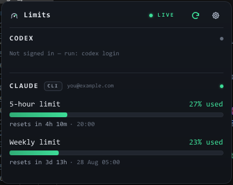

# Platform notes

One tree, two desktops. The panel, the colours and the countdown are the
same on both; what differs is the tray each platform offers and what each
one asks of an unsigned app.

## macOS

**Verified on Apple silicon.** The release bundle is a universal binary and
the `Info.plist` declares macOS 11 as the minimum, but no Intel Mac and no
older macOS has been tried; treat that floor as declared, not measured.

- **No Dock icon by default.** The app runs under the accessory
  (`LSUIElement`) policy: it lives in the menu bar and nowhere else. Left-
  click the glyph for the panel, right-click for the menu. The panel and
  the menu-bar title call themselves "Limits" — the name of the meter
  inside Tickover.
- **First launch of an unsigned build.** Releases are not yet signed with a
  Developer ID, so Gatekeeper says "Apple could not verify Tickover is free
  of malware". Right-click → *Open*, or System Settings → Privacy & Security
  → *Open Anyway*, or from a terminal:

  ```bash
  xattr -d com.apple.quarantine /Applications/Tickover.app
  ```

  [`RELEASING.md`](RELEASING.md) says what changes once signing exists.
- **Keychain prompts.** Claude's token comes from `~/.claude/.credentials.json`
  when that file exists; only when it is absent does the app ask the
  Keychain, and macOS asks you. Answering *Don't Allow* leaves the Claude
  section empty until a relaunch. The Claude *desktop* account is a separate
  opt-in in Settings and needs its own grant (*Always Allow* for
  `Claude Safe Storage`). Antigravity's token is read from the Keychain item
  its CLI writes.
- **When the menu bar is full.** macOS silently drops a status item when
  there is no room — every API still reports it as visible, and the icon
  simply never draws, so a tray-only app becomes unreachable, settings
  included. **Dock mode** is the way out:

  ```bash
  open --env TICKOVER_DOCK=1 "/Applications/Tickover.app"
  ```

  The panel becomes an ordinary draggable window reachable from the Dock and
  the app switcher; the menu-bar item stays. The setting persists; `=0`
  turns it off. The app cannot decide this for you, because macOS does not
  say when an item was dropped. The reasoning, and the rules for who moves
  the window and when, are in [`DOCK-MODE.md`](DOCK-MODE.md).
- **Launch at login** is a login item, added and removed by the toggle in
  the panel or the tray menu.
- `TICKOVER_SNAPSHOT=out.png` renders the panel to a PNG and exits — this is
  how the panel screenshots in this repository were taken (the menu-bar
  pill comes from the `widget_probe` example).

## Windows 11

**Built and run on Windows 11 x86_64 (MSVC).** The release is a bare
`tickover.exe`; there is no installer, and none is needed — launch-at-login
is handled by the app.

- **No console window.** The binary is built with the `windows` subsystem
  and goes straight to the notification area.
- **First launch of an unsigned build.** SmartScreen says "Windows protected
  your PC / Unknown publisher": *More info* → *Run anyway*. The plan for
  signing is in [`RELEASING.md`](RELEASING.md).
- **Finding the icon.** Windows parks a new notification icon in the
  overflow area behind the `^` arrow next to the clock. Drag it onto the
  taskbar to keep it in sight; Windows remembers that per binary path.
- **The flyout opens on whichever side of the icon has room** — above it,
  with the taskbar at the bottom. A click outside it dismisses it, as a
  flyout should. If you want the
  numbers left on screen while you work, the same switch as on macOS
  applies:

  ```powershell
  $env:TICKOVER_DOCK = "1"; .\tickover.exe
  ```

  The window then keeps a taskbar button and an Alt-Tab entry of its own and
  stops hiding on focus loss. The setting persists; `"0"` clears it.
- **The tray reading is a badge, not a pill.** Windows has no title beside a
  notification icon, so *Show stats in the tray icon* draws the bars inside
  the icon itself — one per quota window, grouped by provider, at the tray's
  own icon size so it stays sharp at 100 %, 150 % and 200 % scaling — and
  puts the figures in the tooltip. Like the macOS pill, it has room for two
  providers; with more configured, it shows the first two by order and the
  flyout still lists all of them.
- **Launch at login** writes an entry under
  `HKCU\Software\Microsoft\Windows\CurrentVersion\Run`, with the path quoted
  so an install under a folder with a space in its name still starts.
  Moving or renaming the `.exe` leaves that entry pointing at where it used
  to be: toggle it off and on again after moving it.
- **The Explorer icon needs no installer either:** `build.rs` embeds
  `assets/app-icon.ico` as a Win32 resource on every Windows build, so the
  `.exe` carries its own icon in Explorer, Alt-Tab and its message boxes.
- **A Start-menu entry** is a shortcut to `tickover.exe` dropped into
  `%APPDATA%\Microsoft\Windows\Start Menu\Programs`; an installer (Inno
  Setup, WiX) is the option if a full setup experience is ever wanted.
- **Credentials.** The Claude CLI account reads live from
  `~/.claude/.credentials.json`. The Credential Manager and DPAPI steps
  compile and are reached but had nothing to find on the machine this was
  checked on.
- **The plugin manager's dialogs** — import, remove, install approval,
  error alerts — are native message boxes and the common file picker.
- `TICKOVER_SNAPSHOT` is switched off on Windows: the renderer's snapshot
  comes back as an empty buffer there (and sometimes aborts), so the app
  says so and writes nothing rather than an empty PNG. The Windows
  screenshot in this repository is a screen capture:

  

Where the app keeps its files on each platform, and every environment
variable it reads, are in [`CONFIGURATION.md`](CONFIGURATION.md). Building
from source on either platform: [`DEVELOPMENT.md`](DEVELOPMENT.md).
